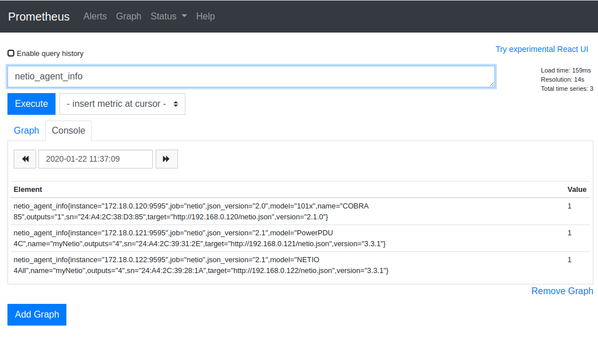
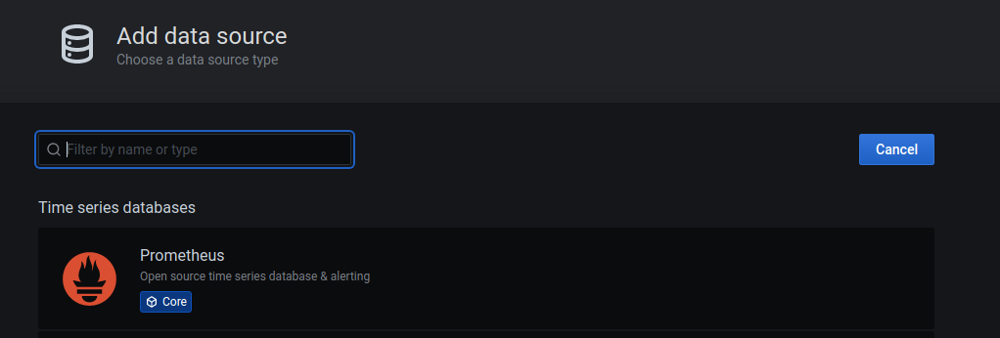
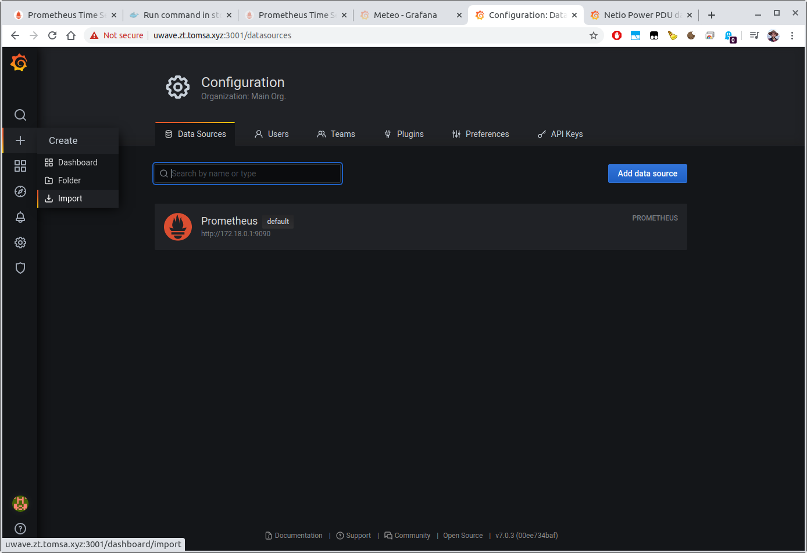

# Netio aplikační poznámka: Integrace Netia s monitorovacím systémem Prometheus a vizualizace dat v Grafaně

Tato aplikační poznámka popisuje, co je [Prometheus](https://prometheus.io/docs/introduction/overview/),
jak ho využít ke sběru dat ze zásuvek Netio, a jak sesbíraná data přehledně zobrazit v [Grafaně](https://grafana.com/)

## Co je Prometheus
[Prometheus](https://prometheus.io) je populární open-source nástroj využívaný pro monitorování a hlášení výjimenk (alerting).
Prometheus vznikl v roce 2012 a od té doby je stále populárnější a mnoho společností ho používají jako klíčovou komponentu svých systémů.
Prometheus zaznamenává aktuální metriky do databáze časových řad (time-series database). V těcho datech je možné snadno vyhledávát a vytvářet
na jejich základě alerty a posílat upozornění.

Ekosystém Promethea se skládá z mnoha komponent:
- centrální server Prometheus - shromažďuje a ukládá data
- knihovny pro použití v klientských aplikacích
- "push gateway" pro krátkodobá měření
- exportery dat pro nástroje a aplikace, které nedokáží poskytnout data ve formátu vhodném pro Prométheus
- správce notifikací (alertmanager)


Více se dočtete o Prométheu na [odkazu](https://prometheus.io/docs/introduction/overview/)

## Netio exporter
Některé modely Netio zásuvek jsou vybaveny [měřením spotřeby](https://www.netio-products.com/en/glossary/power-measurement).
Tato data jsou dostupná přes [API](https://www.netio-products.com/en/glossary/m2m-m2m-api). Je velmi důležíté mít vhled do
těchto dat a být schopen tato data analyzovat a případně si nechat zaslat notifikaci v případě problému.
Prometheus je vhodný nástroj pro ukládání těchto dat a s Netiem se hezky doplňuje.

Prometheus pracuje na tzv. stahovacím "pull" režimu, kdy si v pravidelných intervalech žádá cílová zařízení o data. Vyžaduje specifický [formát](https://prometheus.io/docs/concepts/data_model/#notation) odpovědi.
Vypadá zhruba takto:
```
<metric name>{<label name>=<label value>, ...} <value>
api_http_requests_total{method="POST", handler="/messages"} 103
```
Pokud bychom chtěli stahovat data z aplikace či zařízení, které nepodporuje formát Promethea, musí být mezi zařízení a Prométheus vložen tzv. exportér.
Ten slouží jako můstek mezi zařízením a Prometheem a překládá data do formátu srozumitelného pro Prometheus.

Protože Netio nezná datový formát Promethea, je potřeba pro něj použít exportér. Pro Netio existuje open-source [Netio Exporter](https://github.com/tomsajan/netio-exporter).
Tento exporter využívá [JSON](https://www.netio-products.com/files/NETIO-M2M-API-Protocol-JSON.pdf) API Netia pro získání potřebných dat o spotřebě.

## Grafana
Jak už jsme si řekli v předchozích odstavcích, Prometheus je skvělý pro sbírání dat. Dokonce umí i nějaké základní vizualizace a jednoduche vyhledávání.
Ale pro lepší prezentaci a užitečné přehledy existuje specializovaný nástroj [Grafana](grafana.com)

Grafana je mocný open-source software pro vizualizaci dat a jejich analýzu. Nabízí snadné propojení s databází Promethea a líbívé grafické prostředi pro zobrazení dat.


## Jak to všechno propojit?
### Instalace Promethea
Nejdříve potřebujeme [nainstalovat](https://prometheus.io/docs/prometheus/latest/installation/) Prometheus.  
Prometheus se dá nainstalovat mnoha způsoby. Nejsnazší způsob je využít dostupných balíčků v rámci Vaší linuxové distribuce. Například na distribucích založených na Debianu stačí zavolat `apt install prometheus`

Univerzálnějsí způsob je použít Docker. Pro instalaci pomocí dockeru prosím následujte [návod](https://prometheus.io/docs/prometheus/latest/installation/#using-docker).

Ať už nainstalujete Prometheus jakýmkoliv způsobem, je potřeba ho po instalaci nakonfigurovat tak, aby dokázal stahovat data z Netia pomocí Netio Exporteru.
Níže je co nejjednodušší funkční konfigurace pro stahování dat ze tří exporterů.

```
# my global config
global:
  scrape_interval:     15s # Set the scrape interval to every 15 seconds. Default is every 1 minute.
  evaluation_interval: 15s # Evaluate rules every 15 seconds. The default is every 1 minute.

# A scrape configuration containing exactly one endpoint to scrape:
# Here it's Netio Exporter.
scrape_configs:
    # The job name is added as a label `job=<job_name>` to any timeseries scraped from this config.
  - job_name: 'netio'

    # metrics_path defaults to '/metrics'
    # scheme defaults to 'http'.

    static_configs:
    - targets:
      - 172.18.0.120:9595
      - 172.18.0.121:9595
      - 172.18.0.122:9595
```
Před použitím je potřeba aktualizovat sekci `targets` tak aby mírily na skutečné adresy a porty bežících Netio Exporterů

Jakmile Prometheus spustíte, měl by být dostupný na portu `9090` na vašem počítaci. Ve většině případů to bude na http://localhost:9090
Mělo by to vypadat následovně:


### Netio
Než spustíme Netio Exporter, je potřeba zapnout a  nakonfigurovat [JSON](https://www.netio-products.com/files/NETIO-M2M-API-Protocol-JSON.pdf) API Netia, které exporter využívá.
Netio exporter potřebuje pouze právo číst (read), přihlašovací údaje (jméno, heslo) jsou dobrovolné.

### Netio Exporter
[Netio Exporter](https://github.com/tomsajan/netio-exporter) může být spuštěn buď přímo jako nativní aplikace nebo v  [Dockeru](https://docker.com).

Existuje zde několik konfiguračních parametrů. Nejdůležitější jsou následující:
It has a few configuration options. The most important are:
- `NETIO_URL` Tento parametr je vyžadován. Říká to exporteru, na jaké adrese je dostupné JSON API Netia. Napříkad `http://192.168.0.1/netio.json`. Tato hodnota vždy záleží na síťové konfiguraci Vašeho Netia
- `NETIO_USERNAME` - dobrovolný parametr s uživatelským jménem
- `NETIO_PASSWORD` - dobrovolný parametr s heslem

Pro více detailů navšťivte https://github.com/tomsajan/netio-exporter#configuration

#### Jako nativní aplikace
Pro spuštění aplikace nativne, stáhněte zdrojové kódy:
```
git clone https://github.com/tomsajan/netio-exporter.git
```
a následujte [návod](https://github.com/tomsajan/netio-exporter#how-to-run)

#### V Dockeru
Spustit aplikaci v Dockeru je ještě jednodušší, odpadá spousta nutných mezikroků (např. pro instalaci závislostí).
Na Dockerhubu již existuje předpřipravený Docker [obraz](https://hub.docker.com/r/tomsajan/netio-exporter/tags).

Spuštění je snadné:
```
docker run -tid -p 9595:9595 -e NETIO_URL=http://192.168.0.242/netio.json -e NETIO_USERNAME=netio -e NETIO_PASSWORD=netio --name netio-exporter tomsajan/netio-exporter:latest
```
je potřeba obět upravit příkaz podle vašeho konkrétního nastavení (jméno, heslo, IP adresa...)

Nyní by měl být Netio exporter dostupný na portu `9595`.


#### Monitorování více Netio zásuvek

Pokud potřebujete sbírat data z více Netio zásuvek, je potřeba nastartovat Netio Exporter pro každou zásuvku zvlášt. Je též potřeba upravit konfigurační soubor pro Prometheus tak, aby obsahoval adresy a porty všech spuštěných Netio Exporterů


#### Data uložená v Prometheu
Pokud je vše správně nastaveno, Prometheus začne stahovat data z Netia. V prohlížeči můžete otevřít uživatelské rozhraní Promethea (např. na http://localhost:9090).
Metriky z Netio Exporteru mají předponu `netio_` (více o metrikách [zde](https://github.com/tomsajan/netio-exporter#prometheus-metrics)).

Začněte psát `netio` a Prometheus by měl nabídnout některé příklady netio metrik. Například `netio_agent_info` vypíše aktuální obecné informace o monitorovaných netio zásuvkách




Nyní se můžete vrhnout do prozkoumávání všech metrik :)

### Grafana
Ačkoliv Prometheus umí zobrazit jednoduché grafy, není určen pro vizualizaci dat. Lepší pohled na věc získáme v Grafaně.
Opet může být nainstalována mnoha způsoby. Návod najdete [zde](https://grafana.com/docs/grafana/latest/installation/). Nicméně v [Dockeru](https://grafana.com/docs/grafana/latest/installation/docker/) to bude asi nejsnazší pro vyzkoušení.


```
docker run -d -p 3000:3000 grafana/grafana
```

Uživatelské rozhraní bude dostupné na portu 3000 na vašem počítači.
Nejužitečnější vlastností Grafany pro naše využítí jsou dashboardy, neboli přehledy. Ty soustředují mnoho grafů na jednu obrazovku a získáme tak rychlý přehled o stavu.

Než se pustíme do přehledů, musíme Grafanu nakonfigurovat tak, aby mohla číst data z Promethea.


- V prohlížeči otevřete stránku grafany na portu 3000
- Výchozí přihlašovací údaje by měly být `admin/admin`
- otevřete stránku `/datasources` (datové zdroje)


- přidejte `prometheus` datový zdroj
- nastavete správnou adresu a port pro instanci `promethea`




Nyní je grafana připravena vyčítat data o Netio z Promethea.
Autor Netio Exportera byl tak laskavý, že krom samotného exporteru připravil i hotový dashboard pro Grafanu, který umí přehledně vizualizovat data z Netio exporteru.

Nahrání dashboardu do grafany je velice snadné. Stačí kliknout na značku + (plus) vlevo nahore na hlavní stránce a v následujícím dialogu vložit ID dashboardu 12022 a kliknout na tlačítko "load". V dalším kroku vybereme datový zdroj Prometheus (ten co jsme předtím do Grafany přidali) a klikneme na "import".
Během pár okamžiků se načte dashboard pro Netio





Takto dashboard vypadá když jsou nějakou dobu sbírána data o třech Netio zásuvkách.
