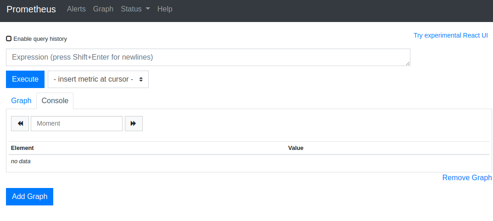
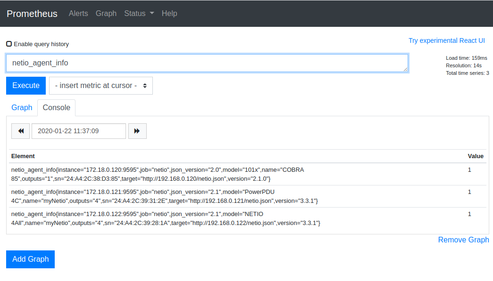
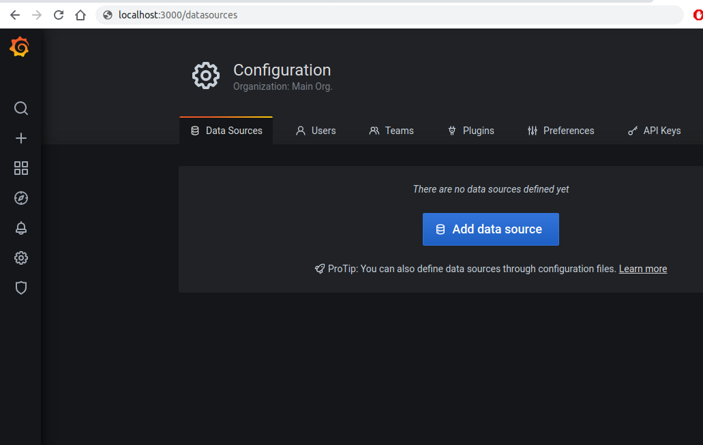
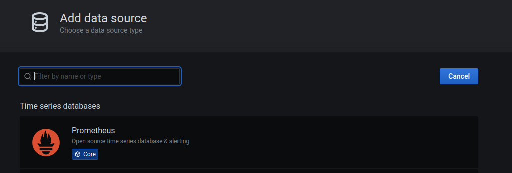
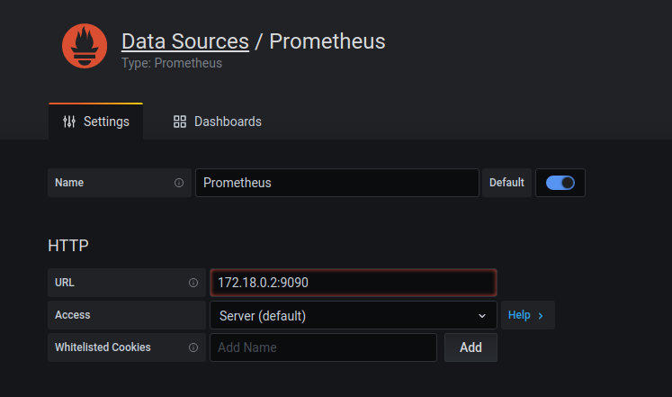
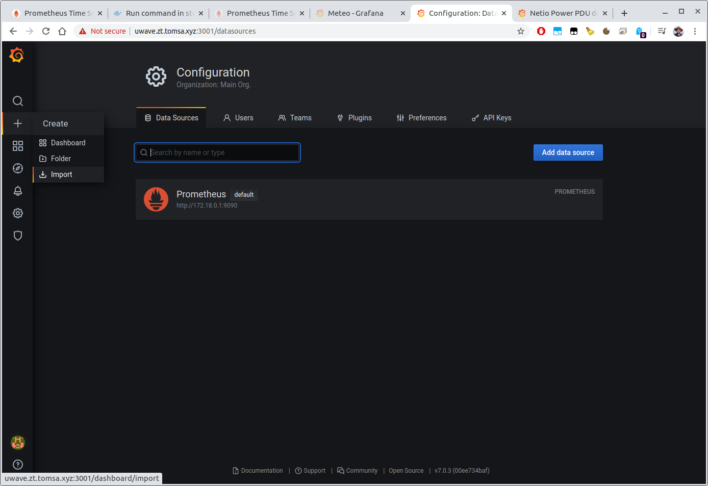
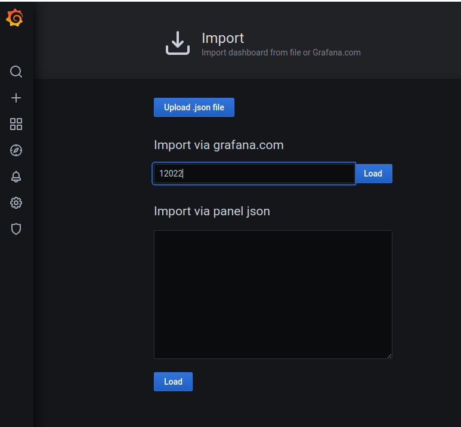
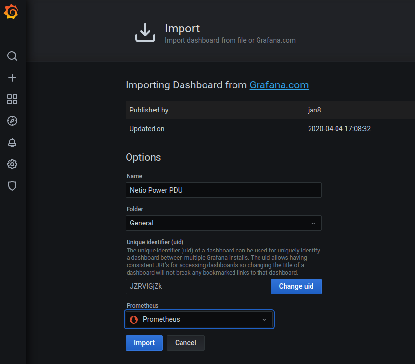
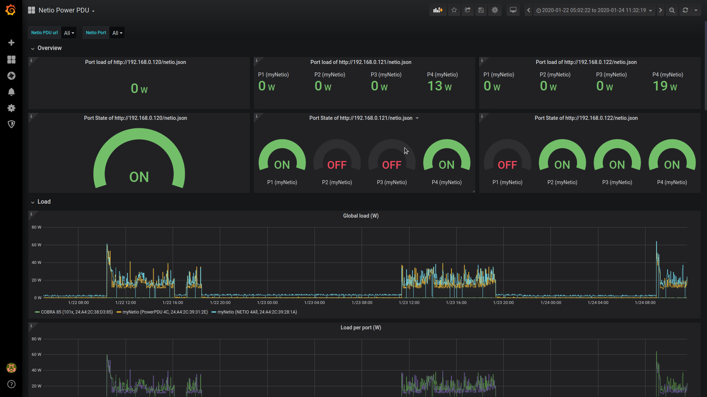

# Netio application note: Prometheus monitoring system netio integration with Grafana data visualisation

This application note describes [Prometheus](https://prometheus.io/docs/introduction/overview/)
monitoring system, how to use it to monitor runtime information about Netio power sockets and how
to visualise obtained data in [Grafana](https://grafana.com/)

## What is Prometheus
[Prometheus](https://prometheus.io) is widely used open-source systems monitoring and alerting toolkit.
Since it's inception in 2012, many companies and organisations have adopted Prometheus and the project has
very active developer and use community. It records real-time metrics in a time series database
built using a HTTP pull model,
with flexible queries and real-time alerting.

The Prometheus ecosystem consists of many specific components:
- the core Prometheus server which scrapes and stores time series data
- client libraries for instrumenting application code
- a push gateway for supporting short-lived jobs
- special-purpose exporters for services like HAProxy, StatsD, Graphite, etc. (or Netio, in this case)
- an alertmanager to handle alerts
- various support tools


More about Prometheus on this [link](https://prometheus.io/docs/introduction/overview/)

## Netio exporter
Some Netio models are equipped with [power measurement](https://www.netio-products.com/en/glossary/power-measurement).
This data is available via [API](https://www.netio-products.com/en/glossary/m2m-m2m-api). It is very useful to gain some
insight into the historical trends of the data Netio provides, to do some calculations and to be able to create alerts based
on events reported by Netio.
Prometheus nicely extends the Netio real-time monitoring capabilities with it's own time-series database and analytical tools.

Prometheus works in a `pull based` mode. It means it regularly requests time series data in a specific [format](https://prometheus.io/docs/concepts/data_model/#notation).
The format of the prometheus data looks roughly like this:
```
<metric name>{<label name>=<label value>, ...} <value>
api_http_requests_total{method="POST", handler="/messages"} 103
```

If we want Prometheus to scrape data from an application that does not support the `Prometheus` format natively,
it needs to be connected via so called `exporter`. Prometheus exporter is basically a data bridge between
the monitored application and Prometheus. It is an tool that on one side connects to the monitored application
via the application's interface and on the other side provides the data translated to the Prometheus format.

Because Netio does not support the prometheus format natively, the data needs to be translated via an exporter.
There is an opensource [Netio Exporter](https://github.com/tomsajan/netio-exporter) that does exactly that.
This exporter utilizes the [JSON](https://www.netio-products.com/files/NETIO-M2M-API-Protocol-JSON.pdf) API to get the relevant data from the Netio power sockets.

## Grafana
Prometheus is awesome as a metrics data storage and alerting tool. Although it has a basic UI that could be used
for quick searches and simple visualisations, it is not ideal for nice data presentation and persistent dashboards.
This the area where [Grafana](grafana.com) excels.

Grafana is open source visualization and analytics software. It allows you to query, visualize, alert on, and explore your metrics no matter where they are stored.  
In plain English, it provides you with tools to turn your time-series database (TSDB) data into beautiful graphs and visualizations.

## How to put it all together
### Prometheus installation
First we need to [install](https://prometheus.io/docs/prometheus/latest/installation/) Prometheus.  
There are many options on how to install Prometheus.  
The easiest way is to use the integrated package manager of your linux distribution.  
For example `apt install prometheus` on `debian` based distributions

More universal way to install it is via docker. Please follow the guide on the provided [link](https://prometheus.io/docs/prometheus/latest/installation/#using-docker).

For any way of installation, a configuration file for Prometheus (`prometheus.yml`) must be provided.
Below is a minimal working example for scraping the Netio Exporter.
```
# my global config
global:
  scrape_interval:     15s # Set the scrape interval to every 15 seconds. Default is every 1 minute.
  evaluation_interval: 15s # Evaluate rules every 15 seconds. The default is every 1 minute.

# A scrape configuration containing exactly one endpoint to scrape:
# Here it's Netio Exporter.
scrape_configs:
    # The job name is added as a label `job=<job_name>` to any timeseries scraped from this config.
  - job_name: 'netio'

    # metrics_path defaults to '/metrics'
    # scheme defaults to 'http'.

    static_configs:
    - targets:
      - 172.18.0.120:9595
      - 172.18.0.121:9595
      - 172.18.0.122:9595
```
Please be sure to update the `targets` section to point to the real `addresses` and `ports` of the running Netio Exporters.

Once the prometheus is running, it will be available on your machine on port `9090`. In most cases, it should be accessible on http://localhost:9090

It should look like this:



### Netio
Before starting the Netio Exporter, Netio must be configured and JSON API [enabled](https://www.netio-products.com/files/NETIO-M2M-API-Protocol-JSON.pdf). The Netio Exporter relies on the JSON API.
The Netio exporter needs only `read` access, authentication with `username` and `password` is optional.

### Netio Exporter
[Netio Exporter](https://github.com/tomsajan/netio-exporter) can be run either natively or in [Docker](https://docker.com).
It has a few configuration options. The most important are:
- `NETIO_URL` parameter. This configuration is required. Netio JSON API endpoint must provided. For example `http://192.168.0.1/netio.json`. Please note that this value will depend on you Netio network setup.
- `NETIO_USERNAME` - optional username parameter
- `NETIO_PASSWORD` - optional password parameter

For more detailed configuration, please see https://github.com/tomsajan/netio-exporter#configuration

#### Natively
To run Netio exporter natively, clone the repository:
```
git clone https://github.com/tomsajan/netio-exporter.git
```
and follow the [guide](https://github.com/tomsajan/netio-exporter#how-to-run)

#### Docker
It is even easier to start it in Docker, because no additional setup (like installing python dependencies) is needed.
There is already a prebuilt netio exporter docker [image](https://hub.docker.com/r/tomsajan/netio-exporter/tags).

Running it is as simple as:
```
docker run -tid -p 9595:9595 -e NETIO_URL=http://192.168.0.242/netio.json -e NETIO_USERNAME=netio -e NETIO_PASSWORD=netio --name netio-exporter tomsajan/netio-exporter:latest
```
Please update the command to suit to your environment, i.e. update the netio URL and username/password combo (or remove it if no password needed). Again, please refer to the configuration guide on the github page.

#### Multiple netio power sockets
The netio exporter should be now running and listening on port `9595` (by default).
If you want to monitor more Netio power sockets, a netio exporter must be started separately for each of them.
Please update the `prometheus.yml` configuration file accordingly to include the adresses and ports of all the running `netio-exporter`s instances.

#### Data in Prometheus
If all works, Prometheus should start receiving data from Netio.
You can head over to the `prometheus` UI (most probably available on http://localhost:9090).
Metrics from the `netio exporter` are prefixed with `netio_` (see more [here](https://github.com/tomsajan/netio-exporter#prometheus-metrics)).
Start typing `netio` and it should offer you some netio metrics. Selecting `netio_agent_info` will display current general information about the power sockets


At this moment you are free to explore more metrics at you will.

### Grafana
Although Prometheus can do some basic graphs, it is not intended as data visualisation tool.
To get better view of what's going on in you Netio power sockets, let's take a look on Grafana.

Grafana can be installed in many ways, including distribution specific packages and docker. Please see the installation [guide](https://grafana.com/docs/grafana/latest/installation/).
But again, installing via [Docker](https://grafana.com/docs/grafana/latest/installation/docker/) should be pretty easy for just a test.
```
docker run -d -p 3000:3000 grafana/grafana
```
The Grafana UI will be available on the port `3000` on your machine.
The most useful feature of Grafana in our context is it's dashboarding. It allows us compose a dashboard from multiple graphs to give us a quick overview of a certain field.
But before we dive into the dashboards, we need to configure grafana to use the `prometheus` we installed previously as it's datasource. Note that grafana is fairly universal tool that can cooperate with many different kinds of datasources.

- head over to the grafana UI
- `admin/admin` should be the default `username/password`
- go to the `/datasources` configuration



- add `prometheus` datasource
- set correct address of the `prometheus` instance including port





Now it is ready to access Prometheus (and Netio within it) data.

The author of the `netio-exporter` was so kind that he prepared also a related Grafana [dashboard](https://grafana.com/grafana/dashboards/12022) which visualises the data the `netio-exporter` produces.

Including it into grafana is very easy.
Click on the `plus` sign on the top left corner and select `import`.
In the next dialogue paste dashboard ID `12022` and click `load`. Then on the next step select the previously created prometheus datasource (bottom line) and click `import`.
Now within a second you new dashboard tailored for Netio will appear.







This is how the dashboard looks like with three NETIO power socket connected to prometheus.

